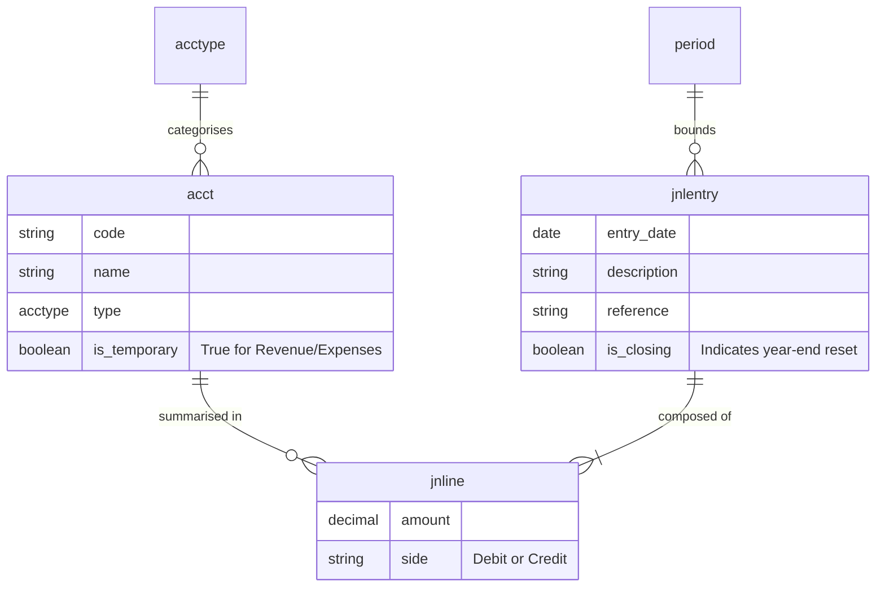
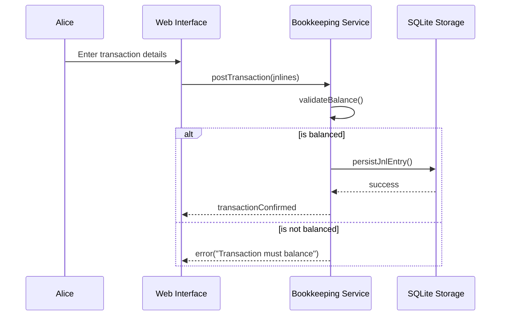

# Modelling: Double-Entry Bookkeeping (DEBK)

This document defines the architectural and logical models for the DEBK system, ensuring alignment with the principles of double-entry bookkeeping and the requirements of ACME Private Limited.

## 1. DDD Components

### Domain Terms and Classification

| Term | Definition | Classification |
| :--- | :--- | :--- |
| **acct** | Account: A named record in the general ledger used to track the balance of a specific asset, liability, equity, revenue, or expense. | Entity |
| **chatofacct** | Chart of Accounts: The hierarchical structure and listing of all `acct` defined for the enterprise. | Value Object |
| **fintxn** | Financial Transaction: A logical business event representing a movement of value (e.g., "Sale to IniTech"). | Domain Event |
| **jnlentry** | Journal Entry: The technical recording of a `fintxn`, comprising multiple `jnline` records that must sum to zero. | Entity |
| **jnline** | Journal Line: A single row within a `jnlentry` that associates an `acct` with a debit or credit amount. | Value Object |
| **acctype** | Account Type: One of the five primary categories (Asset, Liability, Equity, Revenue, Expense) that determine debit/credit rules. | Value Object |
| **genledger** | General Ledger: The "source of truth" containing the full history of all posted `jnlentry` records. | Entity |
| **period** | Accounting Period: A specific timeframe (e.g., Fiscal Year 202X) used for performance measurement and closing. | Value Object |
| **closing** | Closing Entry: A special `jnlentry` that zeroes out temporary accounts (Revenue/Expense) into Retained Earnings. | Domain Event |

### Disambiguation

- **Transaction (`fintxn`) vs. Database Transaction:** A `fintxn` is a business-level concept representing a financial event. A database transaction is a technical mechanism to ensure ACID properties when persisting a `jnlentry`.
- **Account (`acct`) vs. User Account:** `acct` refers exclusively to a ledger account (e.g., "Petty Cash"). User identity and environment isolation are handled as part of system initialisation, not as ledger accounts.
- **Credit (`side`) vs. Credit Limit:** In this system, "Credit" refers strictly to the right-hand side of a journal entry, not a borrowing limit.

---

## 2. Logical Data Model

The following diagram represents the logical structure of the bookkeeping core.

---

## 3. Use Case Analysis

### Persona: Alice

**Profile:** Alice is the founder of ACME Private Limited. She requires a standalone tool that provides absolute privacy and enforces the same rigour as a professional accountant.

#### User Stories

1. **Internal Treasury Movement (Bank to Petty Cash):**
   - **Story:** Alice moves $200 from her bank account to a cash box.
   - **Acceptance Criteria:**
     - The system records a $200 Debit to "Petty Cash" and a $200 Credit to "EFG Bank."
     - Total assets remain unchanged, but the composition is updated.

2. **Complex Split Entry (Payroll):**
   - **Story:** Alice pays Charlie $1,000 gross, with $100 withheld for tax.
   - **Acceptance Criteria:**
     - A single `jnlentry` is created with three `jnline` records.
     - Debit: Salaries Expense ($1,000).
     - Credit: Cash - EFG Bank ($900).
     - Credit: Tax Payable ($100).
     - The system rejects the entry if the total does not balance.

3. **Asset Depreciation (Adjusting Entry):**
   - **Story:** Alice records the monthly $10 loss in value of her office furniture.
   - **Acceptance Criteria:**
     - Debit: Depreciation Expense ($10).
     - Credit: Accumulated Depreciation (Contra-Asset) ($10).
     - The Balance Sheet correctly shows "Net Book Value" (Asset - Contra-Asset).

4. **Closing the Books:**
   - **Story:** At year-end, Alice resets her Revenue and Expense accounts to zero.
   - **Acceptance Criteria:**
     - The system calculates the net balance of all temporary accounts.
     - A closing entry transfers this balance to "Retained Earnings" (Equity).
     - All Revenue and Expense accounts begin the next `period` with a zero balance.

#### Sequence Diagram: Recording a Transaction

---

## 4. Design Thinking: Web Interface

### Dashboard (Financial Pulse)

- **Top Row:** Real-time balances for Assets, Liabilities, and Equity.
- **Middle Row:** Monthly Revenue vs. Expense chart (P&L Trend).
- **Bottom Row:** Recent transactions feed with "Edit/View" links.

### Journal Entry "Workbench"

- A dedicated interface for multi-line entries.
- **Dynamic Balancing:** A "Difference" display that must reach zero before the "Post" button is enabled.
- **Account Suggestions:** Intelligent filtering as Alice types (e.g., typing "Ex" suggests Expense accounts).

### Financial Statements (The "Alice View")

- **P&L:** Categorised by Revenue and Expenses with a clear "Net Profit" footer.
- **Balance Sheet:** Grouped by Current and Fixed Assets, Liabilities, and Equity.
- **Drill-down:** Clicking any amount on a report opens the `genledger` view for that specific account and period.

---

## 5. System Architecture

The DEBK application is designed as a monolithic, standalone tool for local execution, ensuring maximum privacy and simplicity for Alice.

### Architectural Components

- **Monolithic Executable:** The system is packaged as a single executable. The web page, web server, and computational logic are bundled together using Go's `embed` architecture.
- **Local Persistence:** All financial data is stored in a local SQLite database file, eliminating the need for external database servers.
- **Direct Interaction:** The Web UI communicates with the internal web server via a local loopback interface, providing a desktop-like experience entirely within Alice's local environment.

### Benefits for Alice

- **Zero Configuration:** No requirement to install or manage external web servers or database engines.
- **Absolute Privacy:** All computational logic and financial records remain on Alice's local machine.
- **Portability:** The single executable and its database file are easily moved, backed up, or archived.
