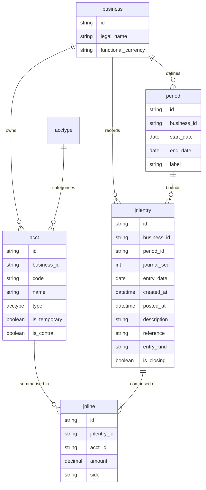
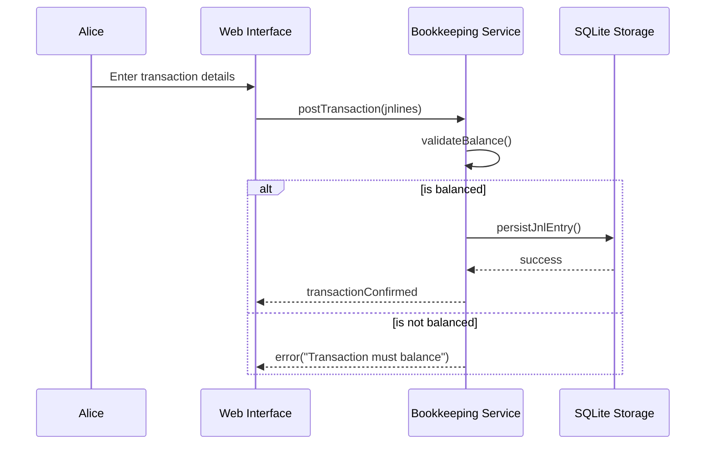

# Modelling: Double-Entry Bookkeeping (DEBK)

This document defines the architectural and logical models for the DEBK system, ensuring alignment with the principles of double-entry bookkeeping and the requirements of ACME Private Limited.

## 1. DDD Components

### Domain Terms and Classification

| Term | Definition | Classification |
| :--- | :--- | :--- |
| **business** | The legal entity whose books are kept (e.g. ACME Private Limited). Root of isolation: every `acct`, `period`, and `jnlentry` belongs to exactly one `business`. | Entity |
| **acct** | Account: A named record in the general ledger used to track the balance of a specific asset, liability, equity, revenue, or expense. | Entity |
| **coa** | Chart of Accounts: The listing of all `acct` defined for the enterprise, categorised by `acctype`. | Value Object |
| **fintxn** | Financial Transaction: A logical business event representing a movement of value (e.g., "Sale to IniTech"). | Domain Event |
| **jnlentry** | Journal Entry: The technical recording of a `fintxn`, comprising multiple `jnline` records that must sum to zero. | Entity |
| **jnline** | Journal Line: A single row within a `jnlentry` that associates an `acct` with a debit or credit amount. | Value Object |
| **acctype** | Account Type: One of the five primary categories (Asset, Liability, Equity, Revenue, Expense) that determine debit/credit rules. | Value Object |
| **genledger** | General Ledger: The "source of truth" containing the full history of all posted `jnlentry` records. | Entity |
| **period** | Accounting Period: A specific timeframe (e.g., Fiscal Year 202X) used for performance measurement and closing. | Value Object |
| **closing** | Closing Entry: A special `jnlentry` that zeroes out temporary accounts (Revenue, Expense, and Dividends/Drawings) into equity (typically Retained Earnings), per the accounting cycle. | Domain Event |
| **trialbal** | Trial Balance: A report listing all `acct` balances to verify that total debits equal total credits. | Value Object |
| **finstmt** | Financial Statement: Structured reports (Balance Sheet, Profit and Loss) derived from the `genledger`. | Value Object |

### Disambiguation

- **Transaction (`fintxn`) vs. Database Transaction:** A `fintxn` is a business-level concept representing a financial event. A database transaction is a technical mechanism to ensure ACID properties when persisting a `jnlentry`.
- **Account (`acct`) vs. User Account:** `acct` refers exclusively to a ledger account (e.g., "Petty Cash"). **Operator identity** (who may open the app) is separate from ledger accounts: it gates access to a `business`. For a single-user deployment, one local database may imply one `business` and one implied operator; multi-user access would associate operators with `business` outside the snippet below.
- **Credit (`side`) vs. Credit Limit:** In this system, "Credit" refers strictly to the right-hand side of a journal entry, not a borrowing limit.

### Mapping rules (alignment with `domain.md`)

- **`fintxn` and `jnlentry`:** In DEBK, one posted business event is captured as **one** `jnlentry` (1:1). The `fintxn` is the domain-language event; the `jnlentry` is its ledger representation. Multi-line economic events (e.g. payroll) are still a single `jnlentry` with multiple `jnline` rows. Optional: store a human-readable `fintxn` label or external reference on `jnlentry` for audit narratives.
- **Contra-asset vs. `acctype`:** The domain chart lists types such as "Contra-Asset." In the data model, **Contra-Asset is not a sixth `acctype`**: it is an **Asset** account with `is_contra = true` (credit normal balance, offsets its paired asset on the balance sheet).
- **Temporary accounts:** Per the domain, **temporary (nominal) accounts** include **Revenue, Expense, and Dividends/Drawings**. Mark `is_temporary = true` for those; **Equity** accounts such as Retained Earnings and Owner's Capital are **permanent** (`is_temporary = false`).
- **Retained Earnings:** Closing and the balance sheet assume a **Retained Earnings** equity `acct`. Initialisation or first-time closing MUST ensure this account exists (create by convention if missing) so net income can be transferred without ad hoc accounts.
- **Posting model:** There is **no separate draft journal vs. general ledger** in persistence: a saved `jnlentry` is **posted immediately** to the `genledger` view (running balances by `acct`). The domain’s “journalise then post” is a logical sequence, not a second storage tier.
- **Currency:** Amounts are in a **single functional currency** per `business` (e.g. USD in the ACME examples). No multi-currency conversion in scope unless added later.
- **Corrections:** Posted `jnlentry` rows are **immutable**. Errors are corrected by **additional** `jnlentry` rows (e.g. reversing entry), preserving a chronological audit trail.

---

## 2. Logical Data Model

The following diagram represents the logical structure of the bookkeeping core.

**Field notes:** `journal_seq` is a monotonic per-`business` sequence for stable audit ordering (in addition to `entry_date`). `entry_kind` distinguishes **normal**, **adjusting**, and **closing** entries to mirror the accounting cycle. `is_temporary` on `acct` is true for Revenue, Expense, and Dividends/Drawings. `is_contra` marks contra-asset (and similar) accounts stored with base type Asset. Each `jnline` has a positive `amount` on exactly one `side` (Debit or Credit).

---

## 3. Use Case Analysis

### Persona: Alice

**Profile:** Alice is the founder of ACME Private Limited. She requires a standalone tool that provides absolute privacy and enforces the same rigour as a professional accountant.

#### User Stories

1. **System Initialisation:**
   - **Story:** Alice sets up her new business identity and initial Chart of Accounts.
   - **Acceptance Criteria:**
     - Alice defines her business name (ACME Private Limited); the system persists a `business` row (`legal_name`, `functional_currency`) as the isolation root for all ledger data.
     - Alice establishes the starting `acct` records (e.g., EFG Bank, Owner's Capital).
     - The system ensures a **Retained Earnings** equity account exists (create if absent) for future closing and the balance sheet.
     - The system validates that the initial `coa` is correctly categorised by `acctype`.

2. **Internal Treasury Movement (Bank to Petty Cash):**
   - **Story:** Alice moves $200 from her bank account to a cash box.
   - **Acceptance Criteria:**
     - The system records a $200 Debit to "Petty Cash" and a $200 Credit to "EFG Bank."
     - Total assets remain unchanged, but the composition is updated.

3. **Revenue Recognition (Credit):**
   - **Story:** Alice provides consulting services to Globex Corp on 30-day credit.
   - **Acceptance Criteria:**
     - A `jnlentry` is recorded with a $2,500 Debit to "Accounts Receivable" and a $2,500 Credit to "Service Revenue."
     - The system correctly identifies "Accounts Receivable" as an Asset and "Service Revenue" as Revenue.

4. **Complex Split Entry (Payroll):**
   - **Story:** Alice pays Charlie $1,000 gross, with $100 withheld for tax.
   - **Acceptance Criteria:**
     - A single `jnlentry` is created with three `jnline` records.
     - Debit: Salaries Expense ($1,000).
     - Credit: Cash - EFG Bank ($900).
     - Credit: Tax Payable ($100).
     - The system rejects the entry if the total does not balance.

5. **Asset Depreciation (Adjusting Entry):**
   - **Story:** Alice records the monthly $10 loss in value of her office furniture.
   - **Acceptance Criteria:**
     - Debit: Depreciation Expense ($10).
     - Credit: Accumulated Depreciation (Contra-Asset) ($10).
     - The Balance Sheet correctly shows "Net Book Value" (Asset - Contra-Asset).

6. **Closing the Books:**
   - **Story:** At year-end, Alice resets temporary accounts (Revenue, Expense, and any Dividends/Drawings) to zero.
   - **Acceptance Criteria:**
     - The system calculates the net activity of all **temporary** `acct` rows (`is_temporary = true`), including **Dividends/Drawings** where used.
     - Closing `jnlentry` rows use `entry_kind = closing` (or equivalent) and transfer net income and dividends effects to **Retained Earnings** (Equity), consistent with `domain.md`.
     - All Revenue, Expense, and Dividends/Drawings accounts begin the next `period` with a zero balance; permanent accounts carry forward.

#### Sequence Diagram: Recording a Transaction

---

## 4. Design Thinking: Web Interface

Use-case coverage is traced in **§4.1**; subsections **§4.2–§4.6** describe the concrete UI surfaces.

### 4.1 Use case ↔ UI matrix

| Use case | UI surface(s) | Notes |
| :--- | :--- | :--- |
| 1. System initialisation | **Business setup** + **Chart of Accounts manager** | Persist `business` (`legal_name`, `functional_currency`), add/edit/archive `acct` rows with `acctype`, `is_temporary`, `is_contra`. Surface validation errors (e.g. invalid type combinations). Auto-provision **Retained Earnings** with clear confirmation if created by the system. |
| 2. Internal treasury movement | **Journal workbench** | Same multi-line posting flow as other entries; optional quick labels (e.g. "Internal transfer") for narrative only. |
| 3. Revenue (credit/cash) | **Journal workbench** | Balancing + account picker; no separate screen required unless templates are added later. |
| 4. Complex split (payroll) | **Journal workbench** | Three+ lines; difference-to-zero gate matches acceptance criteria. |
| 5. Adjusting (depreciation) | **Journal workbench** | User sets **`entry_kind` = adjusting** (or equivalent) so reports and audit lists can filter non-routine entries. Contra-asset accounts appear in pickers when type = Asset + `is_contra`. |
| 6. Closing the books | **Periods** + **Closing assistant** | Select **accounting period** (or fiscal year end); review computed net activity on temporary accounts; confirm generation of **closing** `jnlentry` rows to Retained Earnings. Not a free-form manual line-by-line task unless advanced mode is explicitly offered. |

**Gaps addressed above (previously missing from §4):** onboarding/COA (1), explicit **period** context (6), **entry_kind** in the workbench (5), a dedicated **closing** flow (6), and alignment with **immutability** (see Recent activity below).

### 4.2 Dashboard (Financial Pulse)

- **Context bar:** Active **`business`** name and **functional currency**; **period** or date range selector driving charts and roll-ups where applicable.
- **Top row:** Real-time balances for Assets, Liabilities, and Equity (trial-balance-derived).
- **Middle row:** Revenue vs. Expense trend for the selected range (P&L trend).
- **Bottom row — Recent activity:** Chronological list of posted `jnlentry` rows with **View** (detail + lines). **No in-place edit** of posted entries (see mapping rules: corrections are new entries). Offer **Correct** / **Reverse** that opens the workbench pre-filled with a reversing pattern, or link to documentation.

### 4.3 Journal Entry "Workbench"

- Dedicated flow for **multi-line** `jnline` rows (covers treasury moves, credit sales, payroll, depreciation).
- **Dynamic balancing:** Debit/credit totals and a **difference** indicator; **Post** enabled only when difference is zero; server-side validation remains mandatory.
- **Entry metadata:** **`entry_date`**, **description**, **reference** (source document), and **`entry_kind`**: at least **normal** and **adjusting** for user-authored posts; **closing** is usually created by the **Closing assistant** (§4.5) rather than typed manually.
- **Account suggestions:** Filter by code/name and by **`acctype`**; respect **`is_contra`** in labels (e.g. "Accum. Depreciation (contra-asset)").

### 4.4 General ledger & journal (audit trail)

- **Journal view:** Full **chronological** list of all `jnlentry` rows (filter by date range, `entry_kind`, text search). Satisfies the domain expectation of a complete audit trail, not only "recent" widgets.
- **Account ledger (`genledger`):** Running balance for one `acct` with drill-down from reports (§4.6) and from the COA manager.

### 4.5 Periods & closing assistant

- **Period management:** Define **accounting periods** (`period`: label, start/end) bound to the `business`; postings associate with a period (or derive period from `entry_date` with explicit rules—either way the UI must make the active period obvious for closing).
- **Closing assistant (use case 6):** Stepwise UI: choose period → show **temporary** account balances (Revenue, Expense, Dividends/Drawings) → preview **closing** journal entries → confirm. After close, temporary accounts show **zero** opening for the next period in ledger views.

### 4.6 Financial statements & trial balance ("Alice view")

- **Profit and Loss:** Revenue, Expenses, and **Dividends/Drawings** (when present) for the selected period; **Net income** footer consistent with closing logic.
- **Balance Sheet:** As of date; **Current / Fixed** assets; **contra-assets** netted against related assets so **net book value** matches use case 5 (e.g. Office Equipment less Accumulated Depreciation).
- **Trial balance:** List all `acct` with debit/credit columns and totals (debits = credits). Supports validation mindset from `domain.md`.
- **Drill-down:** Amounts on P&L, balance sheet, and trial balance open **account ledger** or filtered **journal** for the same period/as-of context.

---

## 5. System Architecture

The DEBK application is designed as a monolithic, standalone tool for local execution, ensuring maximum privacy and simplicity for Alice.

### Architectural Components

- **Monolithic Executable:** The system is packaged as a single executable. The web page, web server, and computational logic are bundled together using Go's `embed` architecture.
- **Local Persistence:** All financial data is stored in a local SQLite database file, eliminating the need for external database servers.
- **Direct Interaction:** The Web UI communicates with the internal web server via a local loopback interface, providing a desktop-like experience entirely within Alice's local environment.

### Benefits for Alice

- **Zero Configuration:** No requirement for install or manage external web servers or database engines.
- **Absolute Privacy:** All computational logic and financial records remain on Alice's local machine.
- **Portability:** The single executable and its database file are easily moved, backed up, or archived.
