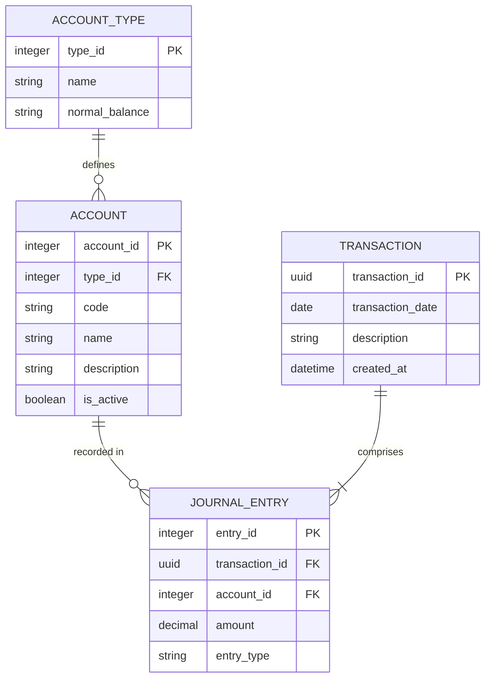

# Entity Data Model

This document outlines the logical data model for the Bilanx double-entry bookkeeping system. It defines the structure required to maintain the accounting equation and ensure financial integrity across the system.

## Entity-Relationship Diagram

The following diagram illustrates the relationships between the core accounting entities.

## Data Dictionary

All technical identifiers (column names) use US English, whilst descriptions follow British English conventions.

### 1. account_type

Defines the high-level classification of accounts used for categorisation and reporting.

| Attribute | Type | Description |
| :--- | :--- | :--- |
| `type_id` | Integer | Unique identifier for the account type. |
| `name` | String | The name of the type (e.g., Asset, Liability, Equity, Revenue, Expense). |
| `normal_balance` | Enum | Indicates whether the account increases with a 'DEBIT' or 'CREDIT'. |

### 2. account

The Chart of Accounts (COA) where individual financial records are maintained.

| Attribute | Type | Description |
| :--- | :--- | :--- |
| `account_id` | Integer | Unique identifier for the account. |
| `type_id` | Integer | Foreign key to `account_type`. |
| `code` | String | Unique accounting code used for organisation (e.g., 1010, 5010). |
| `name` | String | Human-readable name (e.g., Cash at Bank). |
| `description` | String | Optional description of the account's purpose. |
| `is_active` | Boolean | Flag to indicate if the account is currently in use. |

### 3. transaction

A logical grouping of related journal entries representing a single financial event. This ensures the atomicity of the double-entry process.

| Attribute | Type | Description |
| :--- | :--- | :--- |
| `transaction_id` | UUID | Unique identifier for the transaction. |
| `transaction_date` | Date | The date the transaction occurred. |
| `description` | String | A brief explanation of the transaction for audit purposes. |
| `created_at` | DateTime | System timestamp when the transaction was first recorded. |

### 4. journal_entry

The individual debit and credit lines that make up a transaction.

| Attribute | Type | Description |
| :--- | :--- | :--- |
| `entry_id` | Integer | Unique identifier for the entry. |
| `transaction_id` | UUID | Foreign key to `transaction`. |
| `account_id` | Integer | Foreign key to `account`. |
| `amount` | Decimal | The monetary value of the entry. Must be a non-negative value. |
| `entry_type` | Enum | Specifies whether the entry is a 'DEBIT' or 'CREDIT'. |

## Integrity Constraints

1. **Double-Entry Balance:** For any given `transaction_id`, the sum of `amount` where `entry_type` is 'DEBIT' must equal the sum of `amount` where `entry_type` is 'CREDIT'.
2. **Immutability:** Once a `transaction` is posted, it should not be modified to preserve the integrity of the audit trail. Corrections must be performed via reversing entries or specific adjustment transactions.
3. **Account Type Consistency:** Every `account` must be linked to a valid `account_type` to ensure correct balance sheet and income statement generation.
4. **Unique Codes:** The `code` attribute in the `account` table must be unique to ensure precise identification in the General Ledger and Trial Balance.
