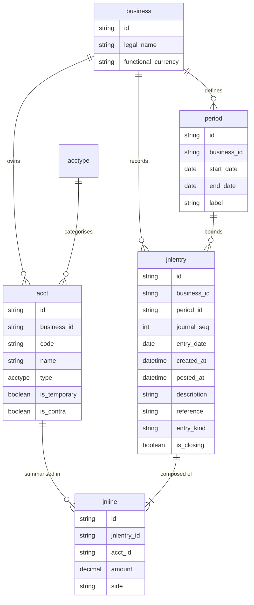
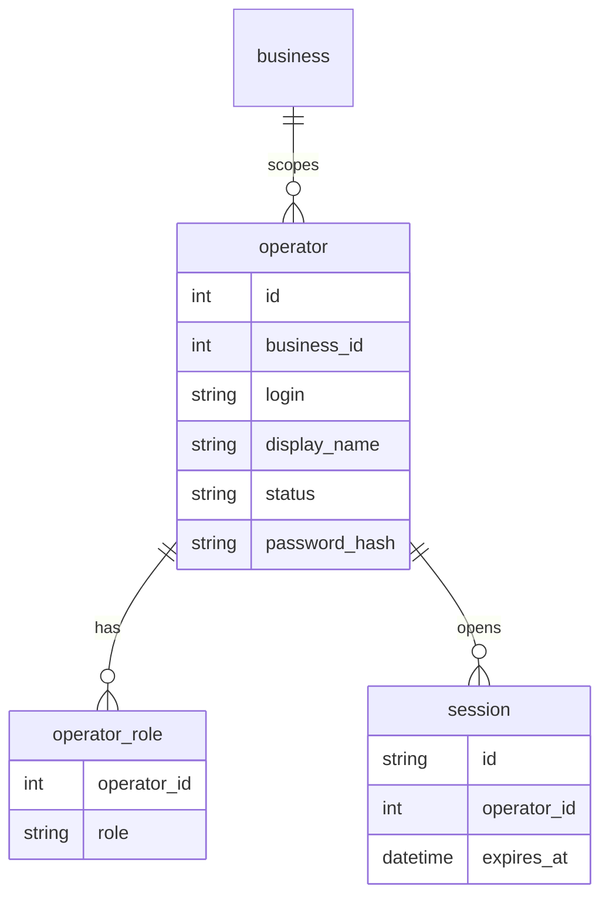

# Logical Data Model

The following diagram represents the logical structure of the bookkeeping core.

**Field notes:** `journal_seq` is a monotonic per-`business` sequence for stable audit ordering (in addition to `entry_date`). `entry_kind` distinguishes **normal**, **adjusting**, and **closing** entries to mirror the accounting cycle. `is_temporary` on `acct` is true for Revenue, Expense, and Dividends/Drawings. `is_contra` marks contra-asset (and similar) accounts stored with base type Asset. Each `jnline` has a positive `amount` on exactly one `side` (Debit or Credit).

## Identity (IAM) — logical addendum

Bookkeeping entities above are scoped by **`business`**. **Operators** (human principals) authenticate into the app; their membership and **roles** are stored separately from ledger `acct` rows.

- **`operator`:** Unique **login** per `business_id`; **password_hash** at rest; **status** active/disabled.
- **`operator_role`:** One row per assigned role (`admin`, `user`); effective permissions are the **union** of role bundles (`internal/authz/authz.go`).
- **`session`:** Opaque session id bound to `operator_id` with expiry; issued to the browser as an HTTP-only cookie for authenticated API calls.

Physical table and column names in SQLite follow `internal/dbmigrate` and `internal/domain/operator` / `session`.
