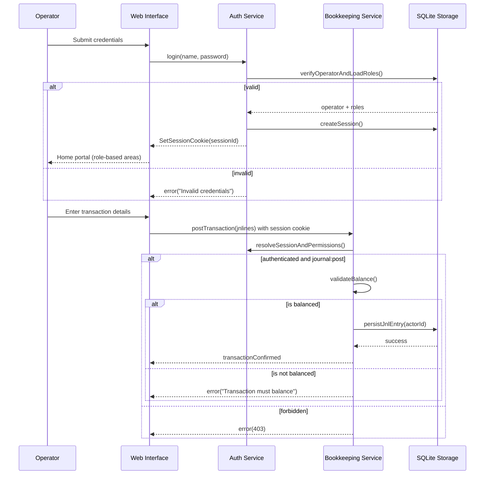

# System Architecture

The DEBK application is designed as a monolithic, standalone tool for local execution, ensuring maximum privacy and simplicity for the operator.

The application system architecture is monolithic. The web page, web server and computational logic are packaged as a single executable as per Go embedding architecture.

## Architectural Components

- **Monolithic executable:** The system is packaged as a single executable. The web page, web server, and bookkeeping logic are bundled together using Go's `embed` architecture.
- **Local persistence:** All financial data is stored in a local SQLite database file, eliminating the need for external database servers.
- **Direct interaction:** The web UI communicates with the internal web server via a local loopback interface, providing a desktop-like experience entirely within the operator's local environment.
- **Identity and access management (IAM):** Described below; all mutating API routes and sensitive reads are gated on an **authenticated principal** with **role-based** permissions scoped to the **`business`** held in that database file.
- **Collaborative use, not distributed:** Several operators (e.g. **Administrator** and **User** personas in `usecase.md`) use the **same** running instance and **same** SQLite file. The system is **not** a distributed application: there is **no** multi-node DEBK cluster or replicated application tier in baseline scope.
- **Post-login shell (web):** After authentication, the SPA presents a **role hub** with up to three entry points—**identity & access**, **configuration (COA)**, and **bookkeeping**—each shown only if the signed-in operator’s roles include the corresponding permissions. Routes and layout are specified in `models/ui.md`; permission union per role matches `internal/authz/authz.go` (and the web mirror `web/src/authz/rolePermissions.js`).

## Identity and Access Management

DEBK shall support **one or many user accounts** with **access control** (`requirements.md`). Identity is **local-first**: there is no dependency on an external identity provider (IdP), cloud directory, or OAuth broker for core operation. A robust design separates concerns and keeps an auditable trail of **who** performed sensitive actions.

**Use-case alignment:** Multiple distinct operators sign in to **one** deployment on **one** platform (`usecase.md` assumption); authorisation distinguishes their roles against **shared** ledger data.

### Design Principles

| Concern | Intent |
| :--- | :--- |
| **Authentication** | Establish **who** is using the application (verify credentials, issue a bounded **session**). |
| **Authorisation** | Decide **what** that principal may do (RBAC: roles → permissions on resources and actions). |
| **Tenancy** | In a typical deployment, one SQLite file corresponds to one **`business`**; all operators are members of that business. (Multi-business per host is a product choice; isolation remains **per database file**.) |
| **Auditability** | Persist **actor identity** (and timestamp) on ledger mutations where the domain requires a defensible trail (e.g. posted `jnlentry`, COA changes, user administration events). |

### Logical Model (Suggested)

- **`operator` (or `user`):** Human principal—stable id, unique **login name** (or email-style identifier) within the business, display name, **status** (active, disabled), **password hash** (never store plaintext passwords).
- **`role`:** Named bundle of permissions aligned with product access types—**Administrator** (identity management, COA, business profile, bookkeeping) and **User** (bookkeeping and reports only). Roles are **assignable** per operator; **multiple roles** per operator use the **union** of permissions (an operator with both `admin` and `user` is treated as **Administrator** only).
- **`permission`:** Fine-grained capability checks evaluated by the server. Implemented permission strings include at least: `business:read`, `business:write`, `coa:read`, `coa:write`, `journal:read`, `journal:write`, `period:read`, `period:write`, `report:read`, `user:read`, `user:write`, `user:invite`. The UI may hide controls, but **authorisation must be enforced in the service layer** on every mutating call.
- **`session`:** Server-issued session bound to operator id, **expiry**, and optional **rotation** on privilege change or password change. Prefer **opaque server-side session id** stored in an **HTTP-only, Secure, SameSite** cookie over long-lived JWTs in `localStorage` (reduces XSS token theft risk). For loopback-only HTTP, **Secure** may be relaxed with documented trade-offs; **HTTP-only** and **SameSite** remain valuable.
- **`credential`:** Password verified with a modern slow hash (**Argon2id** preferred; **bcrypt** acceptable). Enforce a reasonable **minimum password policy** suitable for a local tool (length + complexity guidance in user docs, not excessive friction for SMEs).

**Where credentials are held (storage):**

- **Passwords:** Only a **password hash** (and parameters such as Argon2 salt) on the **`operator`** row in the **same local SQLite file** as the ledger. **Plaintext passwords are never persisted.**
- **Sessions:** **Opaque session identifiers** and metadata (operator id, created/expiry times) in a **`session`** table (or equivalent) in **that SQLite file**; the browser stores only the **session id** in an **HTTP-only cookie**, not the password.
- **Nothing is sent to a remote identity service** in the baseline design; backup of that database file implies backup of identity data, so deployment guidance should warn operators accordingly.

### Bootstrap and Lifecycle

1. **First run / bootstrap:** The first operator created (or the installer flow) gains **Administrator** rights and establishes the **`business`** record. Subsequent operators are created only by a principal holding **`user:invite`** (Administrators only).
2. **Day-to-day:** Operators authenticate; each HTTP request resolves **session → operator → effective permissions** before dispatch.
3. **Recovery:** Local deployments have no central “forgot password” email. Options: an **Administrator** resets another user’s password; optional **recovery codes** or **backup admin** account documented in the user guide. Out of scope unless specified: self-service email reset.

### Security Controls (Defence in Depth)

- **Rate limiting** on login and password-reset attempts (per client IP / session id) to mitigate brute force on a shared machine.
- **Account lockout** or progressive backoff after repeated failures (balance usability vs abuse on localhost).
- **CSRF protection** for cookie-based session flows on mutating routes.
- **Authorisation on every write:** e.g. Charlene (**User**) must be **denied** COA writes and user administration; only **Administrators** may create or manage operators and assign **Administrator** or **User** access (`usecase.md`, `internal/authz`, `internal/domain/operator`).
- **Immutability of posted journals** unchanged: corrections remain new entries; identity attaches to the posting actor.

### Relationship to Ledger Domain

- **Ledger accounts (`acct`)** are not user logins. **Operators** are application identities; **optional** `posted_by` / `created_by` foreign keys on `jnlentry` (and similar on admin tables) satisfy audit expectations without conflating “bank account” with “user account.”

### Sequence Diagram: Sign-In Then Record a Transaction

### Out of Scope (Unless Added Later)

- Federated login (SAML/OIDC), multi-factor authentication (TOTP/WebAuthn), centralised account recovery, or cross-device single sign-on.
- Per-row ledger ACLs (e.g. branch-level segregation)—keep **business-wide** RBAC unless requirements expand.
