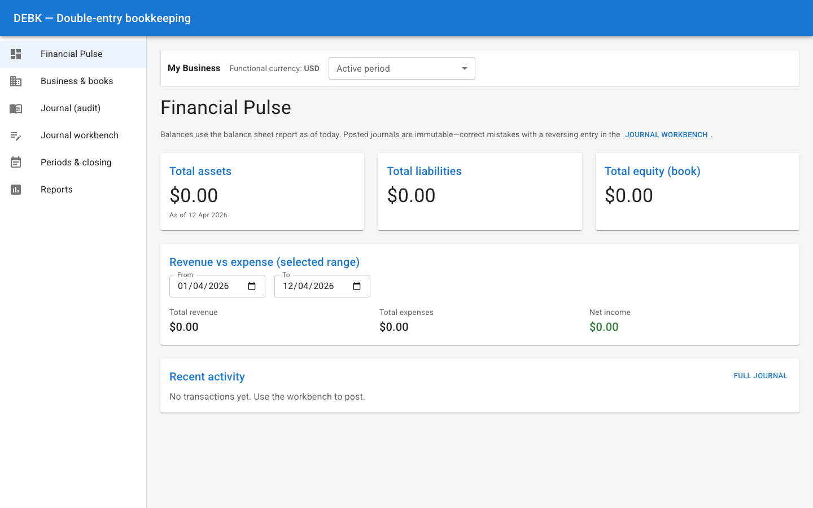
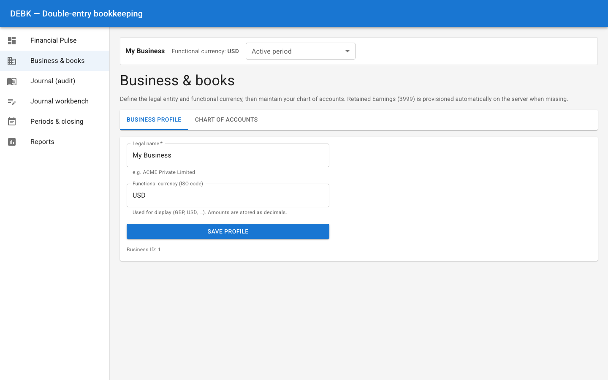
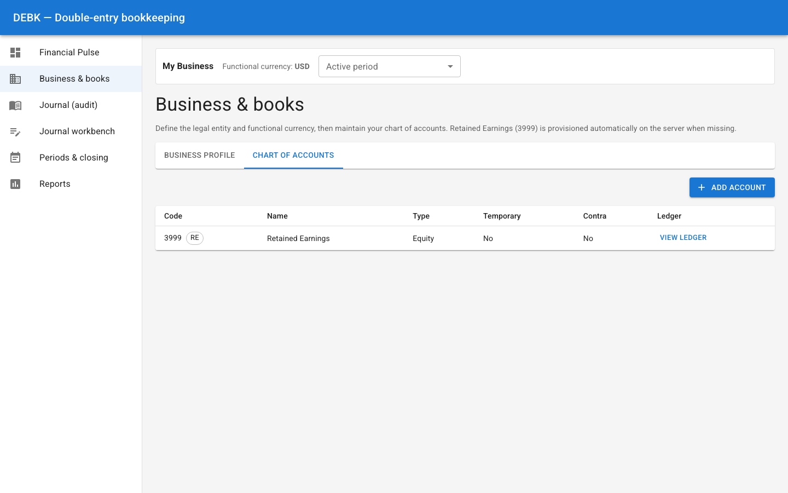
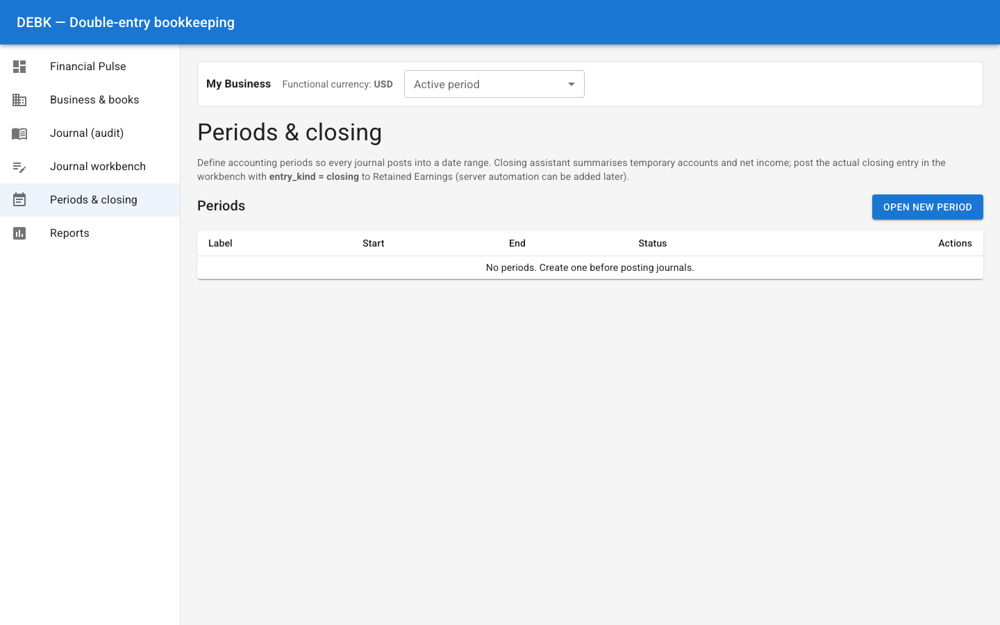
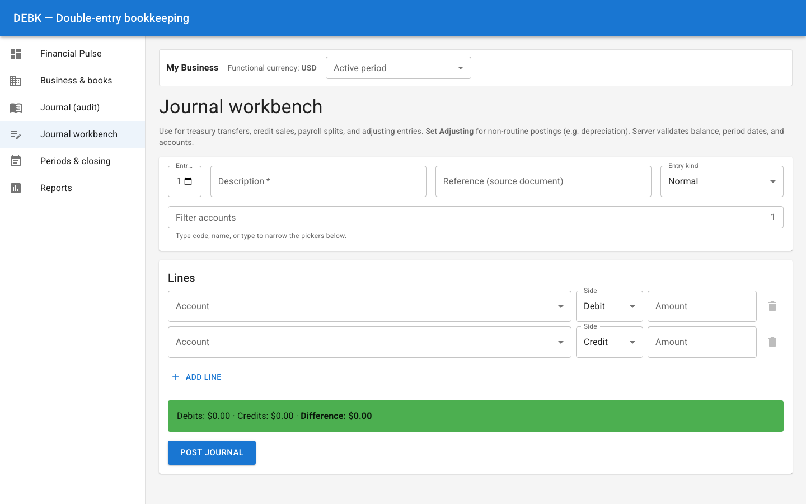
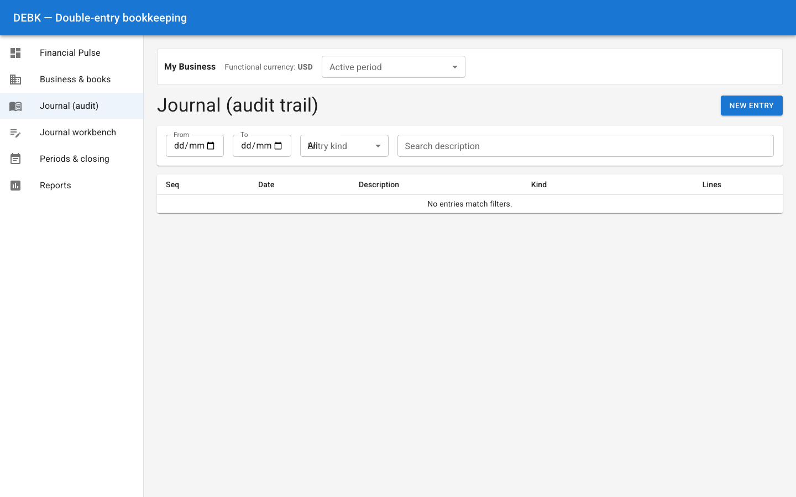
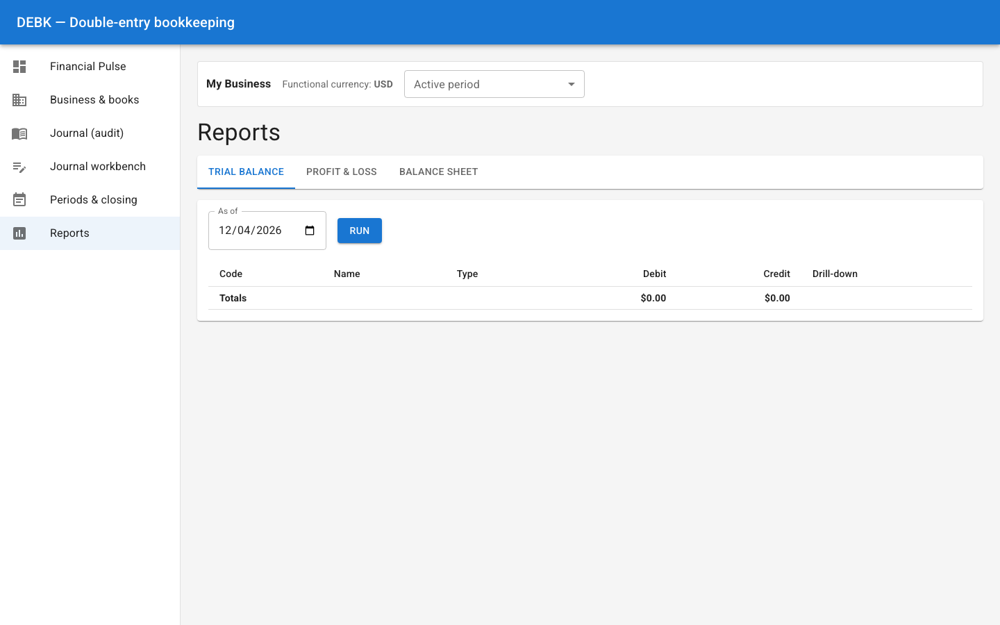

# DEBK user guide

DEBK helps you keep **double-entry** books on your own computer: you define your business, your accounts, and your accounting periods, then record journal entries and print common reports. Everything runs locally in your web browser after you start the application.

The pictures in this guide are **real screens** from DEBK. They show where to click and what you should see while you follow each example.

---

## Opening and closing DEBK

**To start:** open DEBK the way you normally start any program on your computer. It will try to open a browser window automatically. If nothing appears, look for a **web address** in any message the program shows you when it starts, copy it, and paste it into your browser’s address bar.

**To stop:** quit DEBK using the same method you use for other desktop apps (for example, closing the window or stopping the program from the menu). If you started DEBK from a terminal window, you can usually stop it with **Ctrl+C** in that window.

Your books are only on your machine; they are not published to the web by DEBK itself.

---

## Finding your way around: menu and main screen

The **Financial Pulse** screen is a good home base. On a wide window you always see:

- The **menu** on the left (Financial Pulse, Business & books, Journal, and so on).
- The **strip under the top bar** with your business name, currency, and **Active period** (explained in the next section).
- The **main area** with summaries and tables.

Use the menu to switch tasks. You do not need to use every screen every day; the examples later in this guide tell you which one to open.

---

## The bar at the top of each screen

On most pages you will see a strip (just below **DEBK — Double-entry bookkeeping**) that shows:

- **Your business name** — taken from what you entered under Business & books.
- **Functional currency** — the currency labels used everywhere (for example **GBP** or **USD**).
- **Active period** — the accounting period you are “working in” right now. Choose it from the list before you post entries or read figures, so you stay aligned with the right month or quarter.

The same strip appears on the screenshot above. The active period you pick stays selected until you change it or close the browser.

---

## What each menu item is for

| Menu | In plain terms |
| ------ | ---------------- |
| **Financial Pulse** | A quick snapshot: how things look today, a profit-and-loss style range you can change, and your latest journal entries. |
| **Business & books** | Your company name and currency, plus the full list of accounts (your chart of accounts). |
| **Journal (audit)** | A searchable list of everything you have posted; open any entry to read the lines or start a reversal. |
| **Journal workbench** | Where you **create** new journal entries (debits and credits that must balance). |
| **Periods & closing** | Define months or quarters, preview figures at closing time, and mark a period as closed when you are ready. |
| **Reports** | Trial balance, profit and loss, and balance sheet for dates you choose. |

Some screens offer a link to open **one account’s ledger** — a running story of that account only.

---

## Example: set up a new set of books from scratch

Imagine you run a small consultancy called **Riverstone Advisory** and you work in **pounds sterling**.

### 1. Business name and currency

1. In the left menu, click **Business & books**.
2. Stay on the **Business profile** tab (first tab).
3. In **Legal name**, type: `Riverstone Advisory Ltd`.
4. Set **Functional currency** to **GBP** (or your real currency).
5. Click **Save**.

You should see the context strip update with your name and currency when you open other pages.

### 2. Add a few accounts

1. Still under **Business & books**, click the **Chart of accounts** tab.
2. Add accounts you will actually use. For example:

   | Code | Name | Type (example) |
   | ------ | ------ | ---------------- |
   | 1000 | Bank – current | Asset |
   | 4000 | Sales – consulting | Income |
   | 5000 | Rent expense | Expense |

3. Save each account as the form allows.

DEBK also keeps a **Retained earnings**-style equity account for you when the books need it, so you do not have to invent that from scratch.

### 3. Create your first accounting period

1. Open **Periods & closing** from the menu.
2. Click to **add** or **create** a period (wording may vary slightly).
3. Example values:

   - **Label:** `January 2026`
   - **Start date:** `2026-01-01`
   - **End date:** `2026-01-31`

4. Save the period.

Until a journal’s date falls inside a period you have created, DEBK may refuse to save that entry — so do this step before posting.

### 4. Choose the period you are working in

In the **context strip** at the top, open **Active period** and choose **January 2026** (or the period you just created). You already saw this control on the Financial Pulse screenshot at the start of the guide.

---

## Example: record a simple sale (money in the bank)

You invoiced a client **£2,000** and the money arrived in your current account.

1. Go to **Journal workbench**.
2. Set **Entry date** to a day in January 2026 (inside your period).
3. **Description:** `Consulting fees – Project North`.
4. **Entry kind:** leave as **Normal** unless your accountant asked otherwise.
5. Add **two lines** that balance:

   | Account | Side | Amount |
   | --------- | ------ | -------- |
   | Bank – current | Debit | 2,000 |
   | Sales – consulting | Credit | 2,000 |

6. Check that total debits equal total credits, then save or post the entry.

You can confirm it under **Journal (audit)** or on **Financial Pulse** in the recent activity list.

---

## Example: pay office rent from the bank

You paid **£800** rent from the same bank account.

1. **Journal workbench** again.
2. **Entry date:** a valid day in your open period.
3. **Description:** `January office rent`.
4. Lines:

   | Account | Side | Amount |
   | --------- | ------ | -------- |
   | Rent expense | Debit | 800 |
   | Bank – current | Credit | 800 |

5. Save when balanced.

The workbench looks the same as in the previous screenshot; only the accounts, amounts, and description change.

---

## Example: find and fix a mistake with a reversal

Suppose you posted the wrong amount and want to **undo** it with a matching opposite entry (your accountant may call this a reversing journal).

1. Open **Financial Pulse** or **Journal (audit)**.
2. Locate the wrong entry in the list.
3. Use the option to **reverse** or **prepare reversal** (if shown). That typically fills the **Journal workbench** with opposite debits and credits.
4. Read the suggested lines, adjust the **description** if you like (for example `Reversal of incorrect rent posting`), and post as a **new** entry.

Always treat reversals as real journals: they should still balance and use correct dates inside an open period.

---

## Example: run reports at month end

1. Open **Reports**.
2. **Trial balance**  
   - Pick an **as of** date (for example **31 January 2026**).  
   - Load the report. You should see each account and its balance; debits and credits should tie out across the list.
3. **Profit & loss**  
   - Click that tab, set **From** to the first day of the month and **To** to the last day, then load.
4. **Balance sheet**  
   - Click that tab, pick the same **as of** date as your trial balance, then load.

All figures use the **functional currency** you set under Business & books.

---

## Example: use the closing assistant for a period

When a month is finished and you are ready to close it:

1. Open **Periods & closing** (see the screenshot in the setup section above).
2. Find the period (for example **January 2026**).
3. Open the **closing** or **closing assistant** action for that period. DEBK will show summaries that help you see temporary accounts and profit for the period.
4. If your process requires a formal **closing** journal, go to **Journal workbench**, set **Entry kind** to **Closing** where appropriate, and post the entries your accountant expects (often involving **Retained earnings**). The assistant supports your judgement; you still post the actual journal in the workbench when needed.
5. When everything is correct, use the option to **close** the period so new entries cannot fall into that closed range by mistake.

Exact steps depend on your accounting policy; when in doubt, ask your accountant what should be posted before you close.

---

## Example: inspect one account over time

From a report or account list, follow the link to an account’s **ledger** (sometimes shown as the account name or a “view ledger” style link). You will see:

- The account code and name.
- Every journal line that touched that account.
- Running balances, so you can trace how the balance built up.

Useful for answering “why is the bank balance this number?” without reading every journal in the whole business.

---

## If something goes wrong

| What you notice | What to try |
| ----------------- | ------------- |
| Blank page or “cannot connect” | Make sure DEBK is still running, then use the **same web address** the program gave you when it started (if you restart DEBK, it may show a slightly different address — use the new one). |
| Cannot save a journal | Check that **debits equal credits**, the **date** is inside a period you created, and you picked real accounts from your chart. Read any message on the screen — it usually says what failed. |
| Wrong currency on screen | Go to **Business & books → Business profile**, set the right **Functional currency**, and save again. |
| You want a backup | Copy DEBK’s data folder from your computer while DEBK is **fully closed**, or use your normal backup software on that folder. Keep copies in a safe place the same way you would for any important files. |

---

## Quick recap

1. Set **business name** and **currency**.  
2. Build your **chart of accounts** and create at least one **period**.  
3. Pick the **active period** in the context strip.  
4. Post balanced journals in the **workbench**.  
5. Check **Financial Pulse** for a quick view and **Reports** for formal statements.  
6. Use **Periods & closing** when a period is finished.

DEBK is built around **one business** in one place on one computer — enough for many small organisations and sole traders who want clear double-entry books without sharing data online.

---

## Updating the pictures (for people packaging DEBK)

If you change the layout or colours of the app, refresh the PNG files so this guide stays accurate.

1. From the `web` folder, run `npm run build` so the embedded UI matches the latest design.
2. Start DEBK and note the web address it prints (for example `http://localhost:12345`).
3. Install the automation browser once: `npx playwright install chromium` (from `web/`).
4. From `web/`, run:  
   `DEBK_BASE_URL=http://localhost:12345 npm run capture-user-guide-screens`  
   (replace the address with yours).

New images are written to `docs/images/user-guide/`. Commit them with your UI changes.
