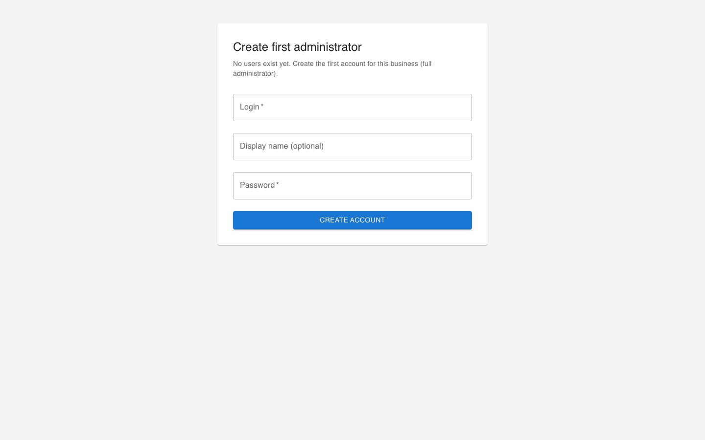
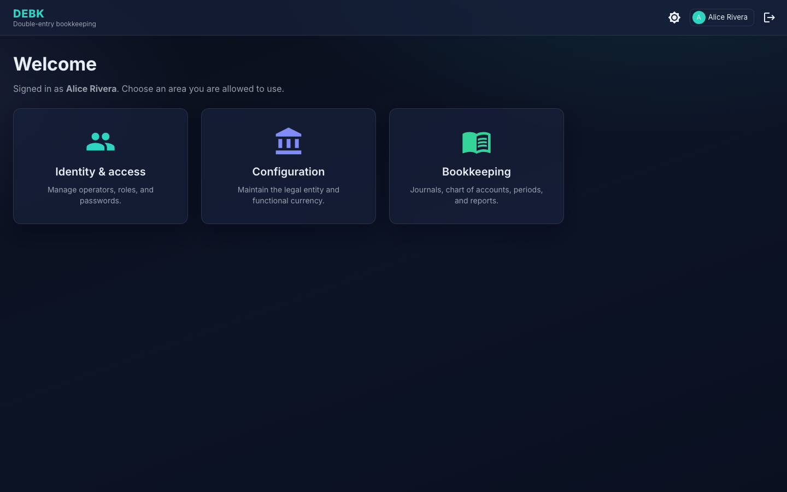
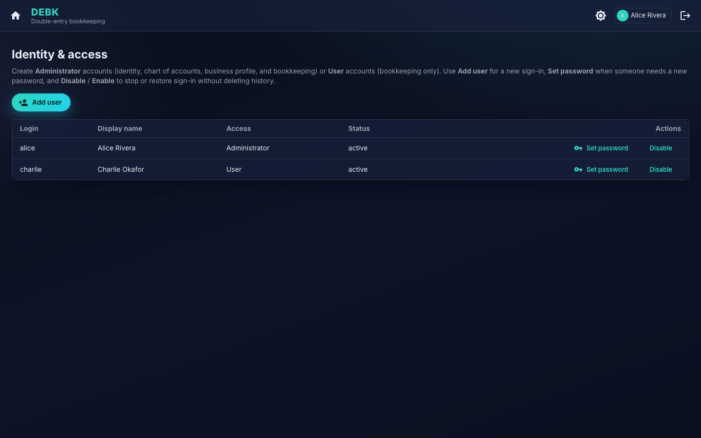

# DEBK user guide

DEBK helps you keep **double-entry** books on your own computer: you define your business, your accounts, and your accounting periods, then record transactions and print common reports. Everything runs locally in your web browser after you start the application.

The pictures in this guide are **real screens** from DEBK. They show where to click and what you should see while you follow each example.

---

## Opening and closing DEBK

**To start:** open DEBK the way you normally start any program on your computer. It will try to open a browser window automatically. If nothing appears, look for a **web address** in any message the program shows you when it starts, copy it, and paste it into your browser’s address bar.

**To stop:** quit DEBK using the same method you use for other desktop apps (for example, closing the window or stopping the program from the menu). If you started DEBK from a terminal window, you can usually stop it with **Ctrl+C** in that window.

Your books are only on your machine; they are not published to the web by DEBK itself.

---

## Signing in and onboarding

When you open DEBK’s address in your browser, you always start at the **sign-in** screen unless the app has never had a user before (a **first installation** of the database).

### Sign-in screen (first administrator or returning user)

The first page is always the same route; the **title** tells you which case applies.

- **First administrator (brand-new installation):** if **no operators** exist yet, the heading reads **Create first administrator**. Enter a **login** (a short sign-in name), an optional **display name**, and a **password**, then choose **Create account**. That account has **Administrator** access: identity management, the business profile, the chart of accounts, and all bookkeeping. DEBK then opens **Identity & access** so you can add colleagues (**Administrator** or **User**) before everyone starts using journals. You can return there any time from the **home** screen.

- **Normal sign-in:** once at least one user exists, the heading reads **Sign in**. Enter the **login** and **password** your administrator gave you, then **Sign in**.



### Home portal (after you are signed in)

The **Welcome** screen lists **tiles** for each area your roles allow. Your name appears under the welcome line. Use the **house** icon in the top bar to return here from anywhere else.

- **Identity & access** — manage who can sign in (**Administrators** only).
- **Configuration** — the business profile (legal name and currency) and a one-time option to **pre-populate the chart of accounts** from a ready-made template (**Administrators** only).
- **Bookkeeping** — the day-to-day books: transactions, chart of accounts, periods, and reports (**Administrators** and **Users**).



### Identity & access (team onboarding)

Users with **Administrator** access see **Identity & access** from the home portal. There you maintain **operators** (who may sign in), their **access type** (**Administrator** or **User**), and **passwords**. Use **Add user** to create an account, **Set password** when someone needs a new password, and **Disable** / **Enable** to stop or restore sign-in without deleting the person’s history.



If you never see this tile, you are signed in as a **User**. Users keep the books in full — including the **chart of accounts** and **periods** — but cannot manage operators or edit the business profile. Ask an **Administrator** if you need either of those.

---

## Finding your way around: bookkeeping layout

From the home portal, open **Bookkeeping** to enter the bookkeeping area. On a **wide** window, a **menu on the left** lists **Overview**, **Journal**, **Chart of accounts**, **Periods**, and **Reports**. You can drag the divider on the right of this menu to make it wider or narrower; drag it all the way in to collapse it to icons only. The **strip under the top bar** (the **context** strip) shows your business name, currency, and **Active period** (explained in the next section). The **main area** shows the screen you picked.


The examples later in this guide name the **home** tile or the **bookkeeping** menu item to open. Use **Home** in the top bar to return to the welcome tiles.

---

## The bar at the top of each screen

On most pages you will see a strip (just below **DEBK — Double-entry bookkeeping**) that shows:

- **Your business name** — taken from what an administrator entered under **Configuration** (the business profile), or the first-run flow.
- **Functional currency** — the currency labels used everywhere (for example **GBP** or **USD**).
- **Active period** — the accounting period you are “working in” right now. Choose it from the list before you record transactions or read figures, so you stay aligned with the right month or quarter.

The same strip appears on the screenshot above. The active period you pick stays selected until you change it or close the browser.

---

## What each bookkeeping menu item is for

(These appear after you open **Bookkeeping** from the home screen.)

| Menu | In plain terms |
| ------ | ---------------- |
| **Overview** | A quick snapshot (the **Financial Pulse** dashboard): how things look today, a profit-and-loss style range you can change, and your latest transactions. |
| **Journal** | Two tabs. **Workbench** is where you **record** transactions using the **Quick Transaction** form. **Audit** is a searchable list of everything you have posted; open any entry to read the lines or start a reversal. |
| **Chart of accounts** | Add and edit the accounts you post to (bank, sales, expenses, and so on). |
| **Periods** | Define months or quarters, preview figures with the closing assistant, and mark a period as closed when you are ready. |
| **Reports** | Trial balance, profit and loss, and balance sheet for dates you choose. |

**Configuration** (from the home tiles, **Administrators** only): the **business profile** — your **legal name** and **functional currency** — and a one-time **Pre-populate chart of accounts** option (see the next section).

Some screens offer a link to open **one account’s ledger** — a running story of that account only.

---

## How the Quick Transaction form works

DEBK records each transaction as a **single entry**, and does the double-entry bookkeeping for you. You fill in a short form:

- **Date** — the day the transaction happened (must fall inside your active period).
- **Description** — a few words so you recognise it later.
- **Amount** — how much, in your currency.
- **Category** — the account that is **debited** (what the money was *for*, such as an expense or the bank receiving money).
- **Paid from** — the account that is **credited** (where the money *came from*, such as your bank or a sales account).

As you choose the two accounts, a small **System entry (auto-generated)** preview shows exactly what DEBK will post: one **DEBIT** line (your Category) and one **CREDIT** line (your Paid from), for the same amount. Always glance at this preview before you post — it confirms the bookkeeping is the right way round.

After you **Post transaction**, the form closes and the **Workbench** shows a **Posted entry** panel confirming what was recorded: the entry’s number and date, your description, and the matching **DEBIT** and **CREDIT** lines with their amounts. The panel updates each time you post, so you always see the double entry DEBK just made without leaving the Workbench. (The full history is still under the **Audit** tab.)

> Tip: “Category” is always the **debit** and “Paid from” is always the **credit**. For an expense paid from the bank this reads naturally. For money *received* into the bank, set **Category** to your bank account (it is debited when money comes in) and **Paid from** to the income account.

---

## Pre-populating your chart of accounts (templates)

Rather than typing every account by hand, an **Administrator** can create a ready-made **chart of accounts** in one step. On the **home** screen open **Configuration**; below the business profile you will find **Pre-populate chart of accounts** with four enterprise types to choose from:

- **Professional services** — consultancies, agencies and practices that bill fees for time and expertise (no stock).
- **Retail** — shops selling goods over the counter, holding stock and taking card payments.
- **E-commerce** — online sellers shipping goods, with payment gateways, marketplaces and fulfilment costs.
- **Manufacturing** — makers turning raw materials into finished goods, with work in progress and plant assets.

Pick the type closest to your business and confirm. DEBK creates a sensible starter set — a bank account, trade debtors and creditors, VAT and payroll control accounts, sales, common overheads, and the accounts specific to your sector (for example *Stock* for retail, or *Raw materials* and *Work in progress* for manufacturing).

A few things worth knowing:

- **It is a one-time setup.** The templates are offered **only while your chart is empty**. As soon as you apply one — or add any account by hand — the options disappear, so you cannot accidentally mix two templates.
- **Administrators only.** The option lives in **Configuration**. If you are a **User** (bookkeeper) you will not see it; ask an administrator to run it for you.
- **You can always extend it.** The created accounts are ordinary accounts. Afterwards, anyone with bookkeeping access adds, renames, or adjusts accounts under **Bookkeeping → Chart of accounts** in the usual way.
- **Retained earnings is handled for you.** DEBK keeps a *Retained earnings* equity account automatically, so it is never part of a template.

If none of the four types fits, simply skip this step and build the chart by hand, as the example below shows.

---

## Example: set up a new set of books from scratch

Imagine you run a small consultancy called **Riverstone Advisory** and you work in **pounds sterling**.

### 1. Business name and currency

1. On the **home** screen after sign-in, open **Configuration** (if you do not see it, you are a **User** — ask an administrator to set this up).
2. In **Legal name**, type: `Riverstone Advisory Ltd`.
3. Set **Functional currency** to **GBP** (or your real currency).
4. Click **Save profile**.

You should see the context strip update with your name and currency when you open other pages.


### 2. Add a few accounts

> Shortcut: if you are an administrator, you can **pre-populate** a whole starter chart from **Configuration** in one step (see *Pre-populating your chart of accounts* above) and then just tweak it here. The manual steps below show how to build or extend the chart by hand.

1. From **home**, open **Bookkeeping**, then **Chart of accounts** in the left menu.
2. Add accounts you will actually use. For example:

   | Code | Name | Type (example) |
   | ------ | ------ | ---------------- |
   | 1000 | Bank – current | Asset |
   | 4000 | Sales – consulting | Revenue |
   | 5000 | Rent expense | Expense |

3. Use **Add account** and save each one.

DEBK also keeps a **Retained earnings**-style equity account for you when the books need it, so you do not have to invent that from scratch.


### 3. Create your first accounting period

1. From **home**, open **Bookkeeping**, then **Periods** from the left menu.
2. Click **Open new period**.
3. Example values:

   - **Label:** `January 2026`
   - **Start date:** `2026-01-01`
   - **End date:** `2026-01-31`

4. Save the period.

Until a transaction’s date falls inside a period you have created, DEBK may refuse to save that entry — so do this step before recording anything.


### 4. Choose the period you are working in

In the **context strip** at the top, open **Active period** and choose **January 2026** (or the period you just created). You already saw this control on the Overview screenshot at the start of the guide.

---

## Example: record a simple sale (money in the bank)

You invoiced a client **£2,000** and the money arrived in your current account.

1. From **home**, open **Bookkeeping**, then **Journal** in the left menu, and stay on the **Workbench** tab.
2. Click **New transaction** to open the **Quick Transaction** form.
3. Set **Date** to a day in January 2026 (inside your period).
4. **Description:** `Consulting fees – Project North`.
5. **Amount:** `2000`.
6. **Category:** `Bank – current` (money coming *into* the bank is a debit).
7. **Paid from:** `Sales – consulting`.
8. Check the **System entry** preview — it should show **DEBIT Bank – current £2,000** and **CREDIT Sales – consulting £2,000** — then choose **Post transaction**.

The **Posted entry** panel then appears on the Workbench, repeating those debit and credit lines so you can confirm at a glance. You can also see it under **Journal → Audit** or on **Overview** in the recent activity list.


---

## Example: pay office rent from the bank

You paid **£800** rent from the same bank account.

1. Open **Journal → Workbench** again (via **home** → **Bookkeeping** if you left that area) and click **New transaction**.
2. **Date:** a valid day in your open period.
3. **Description:** `January office rent`.
4. **Amount:** `800`.
5. **Category:** `Rent expense` (what the money was for).
6. **Paid from:** `Bank – current` (where the money came from).
7. Check the preview shows **DEBIT Rent expense** and **CREDIT Bank – current**, then **Post transaction**.

The form looks the same as in the previous screenshot; only the accounts, amount, and description change.

---

## Example: find and fix a mistake with a reversal

Suppose you posted the wrong amount and want to **undo** it with a matching opposite entry (your accountant may call this a reversing journal).

1. From **home**, open **Bookkeeping**, then **Overview** or **Journal → Audit**.
2. Locate the wrong entry in the list.
3. Use the **Reverse** option. DEBK opens the **Quick Transaction** form already filled in with the **opposite** debit and credit (the Category and Paid from accounts are swapped for you).
4. Read the suggested values, adjust the **description** if you like (for example `Reversal of incorrect rent posting`), and choose **Post transaction** to record it as a **new** entry.

Reversals are real transactions: they still need a date inside an open period. (Older multi-line entries that were not recorded as a single transaction cannot be reversed automatically — re-enter the opposite by hand.)


---

## Example: run reports at month end

1. From **home**, open **Bookkeeping**, then **Reports**.
2. **Trial balance**  
   - Pick an **as of** date (for example **31 January 2026**).  
   - Load the report. You should see each account and its balance; debits and credits should tie out across the list.
3. **Profit & loss**  
   - Click that tab, set **From** to the first day of the month and **To** to the last day, then load.
4. **Balance sheet**  
   - Click that tab, pick the same **as of** date as your trial balance, then load.

All figures use the **functional currency** you set under **Configuration** (the business profile).


---

## Example: use the closing assistant for a period

When a month is finished and you are ready to close it:

1. From **home**, open **Bookkeeping**, then **Periods**.
2. Find the period (for example **January 2026**).
3. Open the **Closing assistant** action for that period. DEBK shows summaries that help you see temporary accounts (revenue and expenses) and the profit for the period.
4. If your process requires a formal **closing**, use **Journal → Workbench** to record the closing transactions with **Quick Transaction** — typically clearing each temporary account to **Retained earnings**, one transaction at a time. The assistant supports your judgement; you still post the actual entries yourself.
5. When everything is correct, use **Close period** so new entries cannot fall into that closed range by mistake.

Exact steps depend on your accounting policy; when in doubt, ask your accountant what should be posted before you close.

---

## Example: inspect one account over time

From a report or the chart of accounts, follow the link to an account’s **ledger** (shown as a “View ledger” style link). You will see:

- The account code and name.
- Every journal line that touched that account.
- Running balances, so you can trace how the balance built up.

Useful for answering “why is the bank balance this number?” without reading every transaction in the whole business.

---

## If something goes wrong

| What you notice | What to try |
| ----------------- | ------------- |
| Blank page or “cannot connect” | Make sure DEBK is still running, then use the **same web address** the program gave you when it started (if you restart DEBK, it may show a slightly different address — use the new one). |
| Cannot post a transaction | Check that you picked an **Active period** in the context strip, the **date** is inside that period, and you chose a **Category** and a **Paid from** account (they must be different). Read any message on the screen — it usually says what failed. |
| Wrong currency on screen | Ask an administrator to open **Configuration**, set the right **Functional currency**, and save again. |
| You want a backup | Copy DEBK’s data folder from your computer while DEBK is **fully closed**, or use your normal backup software on that folder. Keep copies in a safe place the same way you would for any important files. |

---

## Quick recap

1. **Sign in** (or create the **first administrator** once). Use **Identity & access** from the home portal if you need to add operators.  
2. Set **business name** and **currency** under **Configuration** (administrators); while you are there, optionally **pre-populate the chart of accounts** from a template (one-time, administrators).  
3. Build or extend your **chart of accounts** and create at least one **period** (the chart and periods both live under **Bookkeeping**).  
4. Pick the **active period** in the context strip.  
5. Record transactions with **Journal → Workbench → New transaction** (the **Quick Transaction** form); the **Posted entry** panel then confirms the debit and credit.  
6. Check **Overview** for a quick view and **Reports** for formal statements.  
7. Use **Periods** and the closing assistant when a period is finished.

DEBK is built around **one business** in one place on one computer — enough for many small organisations and sole traders who want clear double-entry books without sharing data online.

---

## Updating the pictures (for people packaging DEBK)

If you change the layout or colours of the app, refresh the PNG files so this guide stays accurate.

1. From the `web` folder, run `npm run build` so the embedded UI matches the latest design.
2. Start DEBK and note the web address it prints (for example `http://127.0.0.1:54321`).
3. Install the automation browser once: `npx playwright install chromium` (from `web/`).
4. From `web/`, run the capture script with your base URL and credentials.

**Always set** `DEBK_BASE_URL` to the address DEBK printed when it started.

**First screen (`onboarding-login.png`):** the script saves this before it signs in. You will get **Create first administrator** if the database has no operators yet, or **Sign in** if users already exist.

**Authenticated screens (home portal, identity, bookkeeping, configuration, reports):**

- If you see **Sign in**, set `DEBK_USER_GUIDE_LOGIN` and `DEBK_USER_GUIDE_PASSWORD` to an operator that can reach every area you want in the guide (typically an **Administrator**).
- If you see **Create first administrator**, set `DEBK_USER_GUIDE_BOOTSTRAP_LOGIN` and `DEBK_USER_GUIDE_BOOTSTRAP_PASSWORD` (and optionally `DEBK_USER_GUIDE_BOOTSTRAP_DISPLAY_NAME`) so the script can submit that form once; it will then capture the rest using the new account.

Example (existing user):

```bash
DEBK_BASE_URL=http://127.0.0.1:54321 \
DEBK_USER_GUIDE_LOGIN=alice \
DEBK_USER_GUIDE_PASSWORD='your-secret' \
npm run capture-user-guide-screens
```

Example (bootstrap on an empty database):

```bash
DEBK_BASE_URL=http://127.0.0.1:54321 \
DEBK_USER_GUIDE_BOOTSTRAP_LOGIN=alice \
DEBK_USER_GUIDE_BOOTSTRAP_PASSWORD='your-secret' \
npm run capture-user-guide-screens
```

New and updated images are written to `docs/images/user-guide/`. Commit them with your UI changes.
